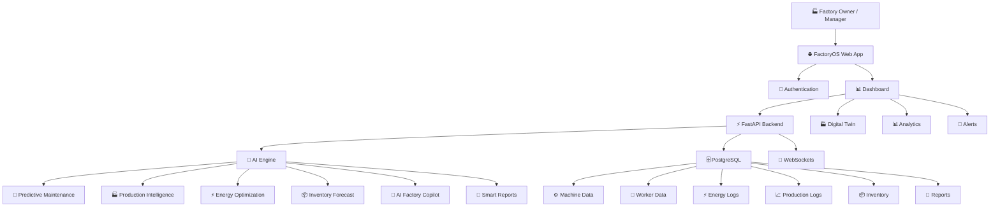

🏭 FactoryOS
The Future of Smart Manufacturing for MSMEs

Transforming Traditional Factories into Intelligent, AI-Driven Smart Factories Without Replacing Existing Machinery

🚀 MSME IDEA HACKATHON 2026 PROJECT

"Making Industry 4.0 affordable and accessible for every MSME."

📖 Overview

FactoryOS is an enterprise-grade AI Smart Manufacturing Operating System designed specifically for Micro, Small, and Medium Enterprises (MSMEs).

Unlike traditional ERP systems, FactoryOS combines Artificial Intelligence, Digital Twins, Predictive Analytics, Production Monitoring, Energy Optimization, Worker Safety, and Smart Manufacturing into one unified platform.

FactoryOS enables MSMEs to digitally transform their factories without replacing existing machinery.

🌍 Vision

To become the Operating System powering every MSME factory in India and beyond.

🎯 Problem Statement

Manufacturing MSMEs face challenges including:

Frequent machine breakdowns
Manual production monitoring
High electricity consumption
Poor inventory visibility
Delayed maintenance
Quality defects
Limited data-driven decision making
Expensive enterprise software

Large companies use expensive Industry 4.0 solutions.

Small manufacturers cannot afford them.

FactoryOS bridges this gap.

💡 Solution

FactoryOS provides

✅ AI Monitoring

✅ Digital Twin

✅ Smart Dashboards

✅ AI Copilot

✅ Predictive Maintenance

✅ Energy Optimization

✅ Worker Management

✅ Inventory Intelligence

✅ Production Analytics

✅ Executive Reports

