<div align="center">

# 🏭 FactoryOS
### AI-Powered Smart Manufacturing Operating System for MSMEs

*Democratizing Industry 4.0 — one factory at a time.*

[](#)
[](#license)
[](#)
[](#)
[](#)

</div>

---

## 📑 Table of Contents

- [Overview](#-overview)
- [The Problem](#-the-problem)
- [Our Solution](#-our-solution)
- [Vision](#-vision)
- [Objectives](#-objectives)
- [System Architecture](#-system-architecture)
- [Data Flow](#-data-flow)
- [Artificial Intelligence](#-artificial-intelligence)
- [Digital Twin](#-digital-twin)
- [Core Modules](#-core-modules)
- [Database Design](#-database-design)
- [Folder Structure](#-folder-structure)
- [Security](#-security)
- [Scalability](#-scalability)
- [Business Model](#-business-model)
- [Expected Benefits](#-expected-benefits)
- [Conclusion](#-conclusion)

---

## 📖 Overview

**FactoryOS** is an enterprise-grade, AI-powered Smart Manufacturing Operating System built to accelerate digital transformation for **Micro, Small, and Medium Enterprises (MSMEs)**. It unifies production monitoring, predictive maintenance, energy optimization, inventory intelligence, workforce management, and AI-driven decision support into a single, affordable platform.

Where traditional ERP systems simply manage business records, FactoryOS functions as the **digital brain of the factory** — continuously sensing, analyzing, predicting, and recommending.

For the **MSME Idea Hackathon** prototype, FactoryOS runs on realistic simulated factory data. The architecture is intentionally designed so this simulation layer can be swapped for live data from IoT sensors, PLCs, smart energy meters, and industrial cameras — with zero changes to application logic.

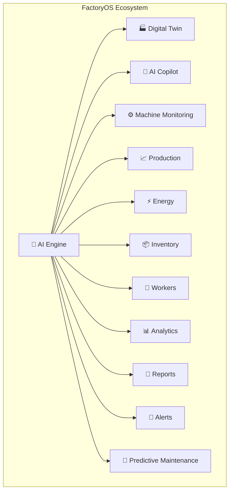

---

## 🎯 The Problem

Manufacturing MSMEs largely run on manual processes, spreadsheets, and disconnected tools, leading to:

| Challenge | Impact |
|---|---|
| Unplanned machine downtime | Production delays and missed deadlines |
| No real-time visibility | Reactive, not proactive, operations |
| High energy consumption | Rising, uncontrolled electricity costs |
| Delayed defect detection | Quality losses and rework |
| Manual inventory tracking | Stock shortages and overstocking |
| No predictive insights | Maintenance happens after failure, not before |
| No centralized decision tools | Fragmented, slow decision-making |
| Expensive Industry 4.0 platforms | Smart manufacturing stays out of reach for MSMEs |

Most existing smart factory platforms are built — and priced — for large enterprises, leaving small and mid-sized manufacturers behind.

---

## 💡 Our Solution

FactoryOS delivers an **affordable, AI-powered intelligence layer** that sits on top of existing factory infrastructure — no machine replacement required.

It continuously analyzes factory data to:
- Detect operational issues as they emerge
- Predict equipment failures before they happen
- Optimize production and energy usage
- Surface actionable insights for owners and managers, in real time

---

## 🚀 Vision

> To democratize Industry 4.0 by making intelligent manufacturing accessible and affordable for every MSME — and to become **the operating system that powers smart factories**, starting in India and scaling globally.

---

## 🎯 Objectives

- Digitize factory operations end-to-end
- Improve production efficiency and OEE
- Reduce unplanned machine downtime
- Optimize electricity consumption
- Improve product quality
- Enhance worker productivity
- Enable true predictive maintenance
- Provide AI-powered decision support
- Reduce operational costs
- Increase overall factory profitability

---

## 🏗 System Architecture

### Complete System Architecture

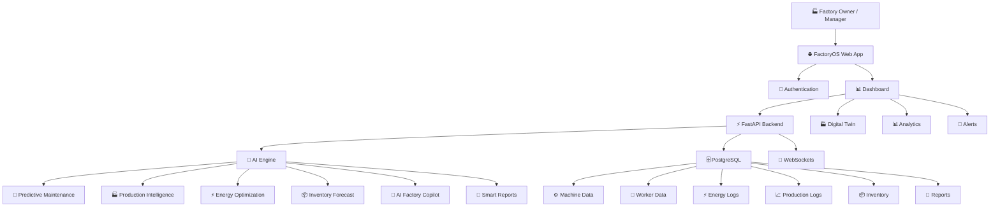

### Backend Architecture

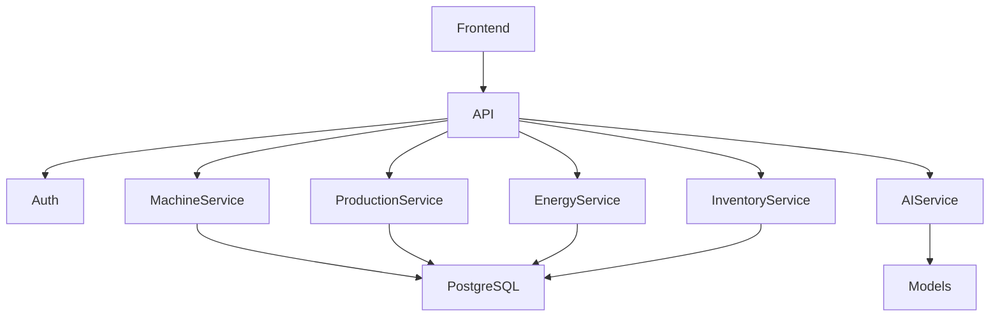

### FactoryOS Module Map

```mermaid
mind map

root((FactoryOS))

Dashboard

AI Copilot

Digital Twin

Machine Monitoring

Production

Inventory

Energy

Reports

Analytics

Workers

Quality

Maintenance

Alerts

Admin

Settings

Notifications

AI Engine
```

---

## 🔄 Data Flow

### Complete Data Flow

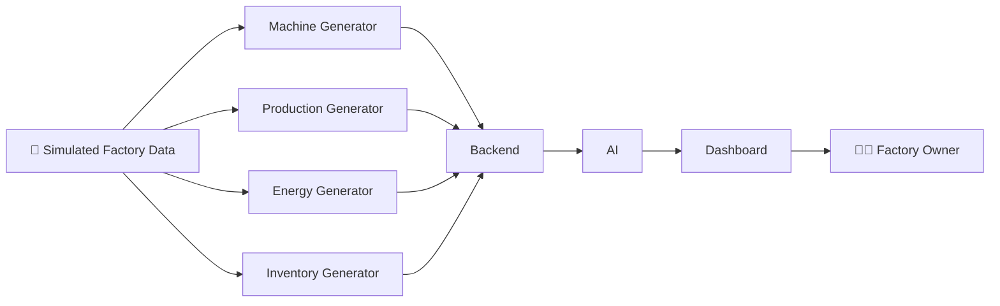

### End-to-End User Flow

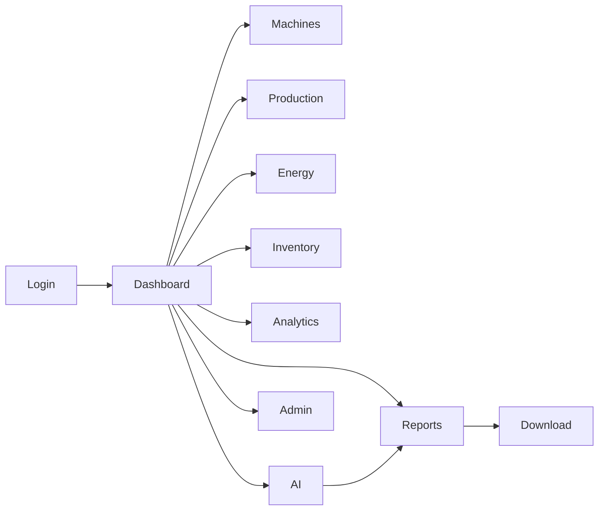

---

## 🤖 Artificial Intelligence

| Capability | What It Does |
|---|---|
| **Predictive Maintenance** | Analyzes machine parameters to estimate health and forecast failures before they occur |
| **Production Forecasting** | Predicts future output from historical production patterns |
| **Inventory Forecasting** | Anticipates raw material needs based on production trends |
| **Energy Optimization** | Analyzes consumption patterns and recommends reduction strategies |
| **AI Recommendations** | Suggests maintenance scheduling, load reduction, capacity increases, reorder points, and shift optimization |

### AI Engine Workflow

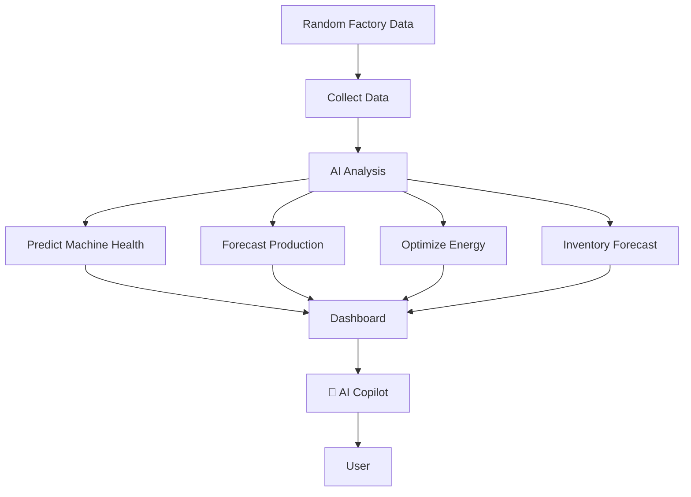

### 💬 AI Factory Copilot

A natural-language interface for factory owners to query the system directly:
- *"Why did production decrease today?"*
- *"Which machine requires maintenance?"*
- *"Show today's electricity cost."*
- *"Generate today's report."*
- *"Predict tomorrow's production."*

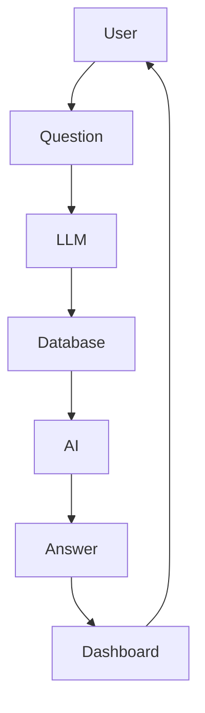

---

## 🏭 Digital Twin

A live virtual replica of the factory floor — layout, machines, status, health, and active alerts — rendered in real time.

| Status | Meaning |
|---|---|
| 🟢 | Running normally |
| 🟡 | Warning — attention needed |
| 🔴 | Critical — immediate action required |
| ⚪ | Offline |

Click any machine to drill into detailed operational data.

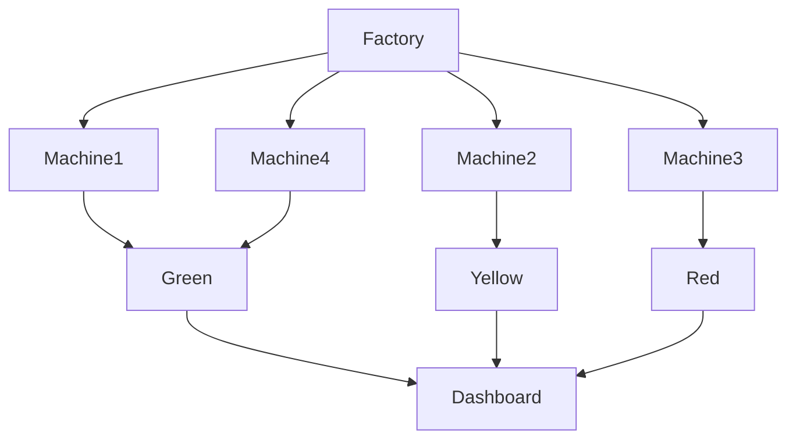

---

## ⚙ Core Modules

### Machine Monitoring
Tracks Machine ID, name, temperature, vibration, voltage, current, power consumption, runtime, downtime, utilization, health score, and maintenance status — updated continuously.

### Predictive Maintenance
Classifies machines into **Healthy → Warning → Maintenance Required → Critical**, auto-generating maintenance schedules to minimize unplanned downtime.

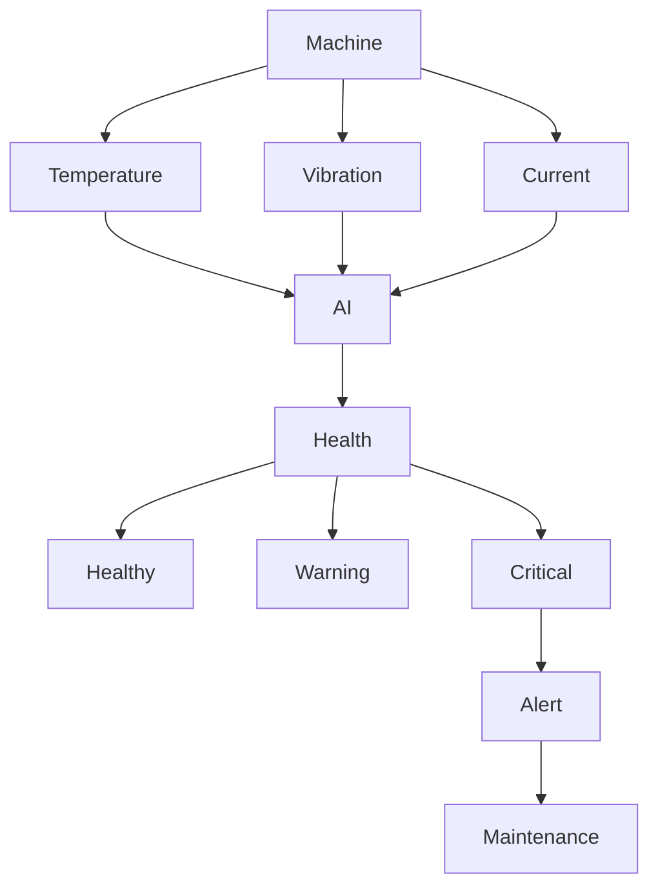

### Production Intelligence
Monitors production targets vs. actuals, efficiency, OEE, production loss, shift performance, and machine productivity — visualized through historical trend charts.

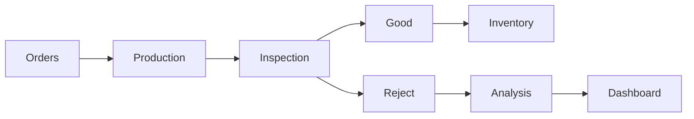

### ⚡ Smart Energy Management
Tracks machine- and department-wise consumption, daily/monthly usage, estimated electricity cost, carbon emissions, and peak-hour patterns, with AI-suggested cost-reduction strategies.

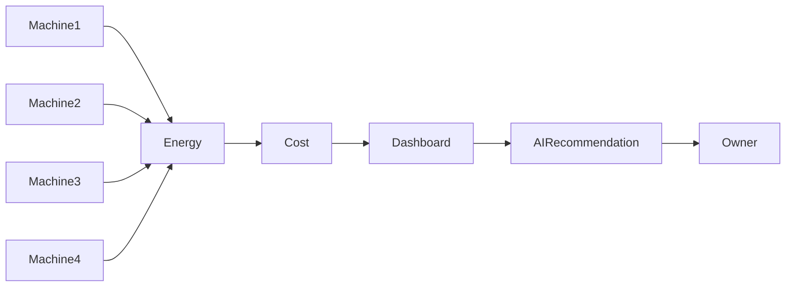

### 📦 Inventory Intelligence
Manages raw materials, finished goods, suppliers, and stock levels with low-stock alerts and AI-predicted purchase schedules.

### 👷 Worker Management
Covers attendance, shift allocation, productivity analysis, safety compliance, and real-time workforce performance tracking.

### 📊 Reports & Analytics
Auto-generates daily, weekly, and monthly reports across production, energy, maintenance, inventory, and executive summaries — exportable as **PDF, Excel, and CSV**.

### 🚨 Smart Alerts
Real-time notifications for overheating, high vibration, production delays, inventory shortages, excessive energy use, maintenance needs, and quality issues.

### 📈 Factory Health Score
A single 0–100 score combining machine health, production efficiency, energy consumption, inventory status, worker productivity, and quality metrics — a one-glance pulse check for management.

---

## 🗄 Database Design

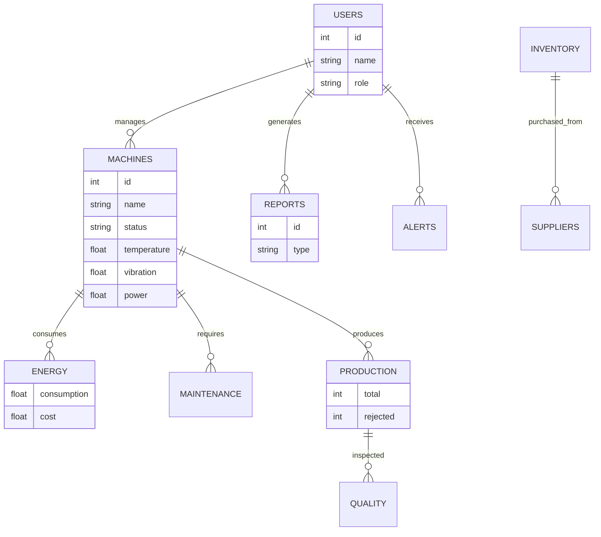

---

## 📁 Folder Structure

```text
FactoryOS
│
├── apps
│   ├── web
│   ├── backend
│   ├── ai-engine
│
├── packages
│   ├── ui
│   ├── database
│   ├── config
│   ├── hooks
│   ├── utils
│
├── docs
├── docker
├── scripts
└── README.md
```

---

## 🛡 Security

- JWT Authentication
- Role-Based Access Control (RBAC)
- Secure APIs
- Encrypted Communication
- Granular User Permission Management

## 🌐 Scalability

Designed to scale from a single factory floor to multi-factory, multi-company deployments — across cloud or on-premise infrastructure.

---

## 💼 Business Model

SaaS subscription model with tiered plans:

| Tier | Target |
|---|---|
| **Starter** | Small factories |
| **Professional** | Growing manufacturers |
| **Enterprise** | Large industrial deployments with custom integrations |

Additional revenue streams: implementation services, AI consulting, customization, training, and premium analytics add-ons.

---

## 🎯 Expected Benefits

- ✅ Reduced machine downtime via predictive maintenance
- ✅ Improved production efficiency and OEE
- ✅ Lower electricity costs through energy optimization
- ✅ Smarter inventory planning
- ✅ Faster, AI-informed decision-making
- ✅ Enhanced worker productivity
- ✅ Improved product quality
- ✅ Reduced operational costs
- ✅ Increased profitability
- ✅ Affordable access to Industry 4.0 technology

---

## 🌟 Conclusion

FactoryOS is more than a dashboard — it's a complete **AI-powered operating system for manufacturing**. By unifying production management, predictive maintenance, energy optimization, inventory intelligence, workforce management, Digital Twin visualization, and AI-assisted decision-making, FactoryOS gives MSMEs a practical path into Industry 4.0 — without the cost or complexity of traditional enterprise systems.

Built for scalability, affordability, and future IoT integration, FactoryOS shows how software intelligence alone can turn a conventional factory into a smart, data-driven manufacturing environment.

---

<div align="center">

**🏆 Built for the MSME Idea Hackathon**

*Made with focus on accessible Industry 4.0 for every manufacturer.*

</div>
